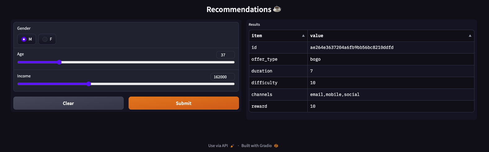

<!-- PROJECT LOGO -->


# Starbucks Offer Recommendation
## 1. Project motivation
Develop a tool to predict the best recommendation, based on the demographic information of a new client.  
3 models are used: best contact channel, spend model and time model to complete the offer.  
The application is displayed in Gradio where the interface is quite practical: you can choose the client's gender, as well as age and income.  
By sending the data, the application provides the most suitable offer from the portfolio according to your profile.

## 2. Installations
- pandas = 1.2.4
- numpy = 1.19.5
- matplotlib = 3.3.4
- seaborn = 0.11.1
- sklearn = 1.1.1
- joblib = 1.1.0
- scipy = 1.5.4
- gradio = 3.35.2

## 3. Files distribution
```
├── app
│   └── run.py  # File that execute the web app
├── data
│   └── portfolio.json  # portfolio of offers
│   └── profile.json  # demographics
│   └── transcript.json # transactions
├── images
├── notebooks  
│   ├── Challenge description.ipynb
│   └── Project Definition
│   └── Analysis  # EDA
│   └── Methodology, results and conclusions
│   └── Predict  # Prediction on demand
├── models  
│   ├── best_channel.pkl # best channel model
│   ├── cuts_spend.npy # cuts of target in spend model
│   ├── spend.pkl # spend model
│   ├── ttc_offer.pkl # time to complete transaction model
│   ├── portfolio_scaler.pkl # scaler of portfolio dataframe
│   └── portfolio_scaled.pkl  # portfolio dataframe scaled
└── README.md     
```

## 4. How to Interact with this project?
Run the following command in the app's directory to run your web app.
```
python run.py
```
c. Go to `http://127.0.0.1:7861`

d. General view of project
