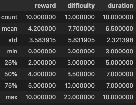

<!-- PROJECT LOGO -->


# <center> **Starbucks Offer Recommendation** </center>

## Table of Contents

1. [Overview](#overview)<br>
2. [Input Data](#input_data)<br>
3. [Strategy for solving the problem](#strategy)<br>
4. [Discussion of the expected solution](#discussion)<br>
5. [Metrics](#metrics)<br>
6. [EDA](#eda)<br>
7. [Data Preprocessing](#preprocessing)<br>
8. [Modeling](#modeling)<br>
9. [Hyperparameter Tuning](#hpo)<br>
10. [Results](#results)<br>
11. [Comparision table](#comparision)<br>
12. [Conclusion](#conclusion)<br>
13. [Improvements](#improvements)<br>
14. [Acknowledgment](#acknowledgment)<br>


## <a class="anchor" id="overview"> **1. Overview**</a>
 We want to identify which demographic group is more likely to respond to a particular offer based on their demographics characteristics.  

However, what if we want to do this for new customers? We would obtain a powerful tool to evaluate all new customers and provide them with the offer that best suits their needs right from the start.

3 models are used: best channel to contact, spend model and time model to complete the offer.  
The application is displayed in Gradio where the interface is quite practical: you can choose the client's gender, as well as age and income.  
By sending the data, the application provides the most suitable offer from the portfolio according to your profile.

## <a class="anchor" id="input_data"> **2. Input Data**</a>
We have information about the customer profile, offer portfolio, and transactions, all of them in json format:
* portfolio.json - containing offer ids and meta data about each offer (duration, type, etc.)
* profile.json - demographic data for each customer
* transcript.json - records for transactions, offers received, offers viewed, and offers completed

Here is the schema and explanation of each variable in the files:

**portfolio.json**
* id (string) - offer id
* offer_type (string) - type of offer ie BOGO, discount, informational
* difficulty (int) - minimum required spend to complete an offer
* reward (int) - reward given for completing an offer
* duration (int) - time for offer to be open, in days
* channels (list of strings)

**profile.json**
* age (int) - age of the customer 
* became_member_on (int) - date when customer created an app account
* gender (str) - gender of the customer (note some entries contain 'O' for other rather than M or F)
* id (str) - customer id
* income (float) - customer's income

**transcript.json**
* event (str) - record description (ie transaction, offer received, offer viewed, etc.)
* person (str) - customer id
* time (int) - time in hours since start of test. The data begins at time t=0
* value - (dict of strings) - either an offer id or transaction amount depending on the record

## <a class="anchor" id="strategy"> **3. Strategy for solving the problem** </a>
The project aims to estimate the best recommendation for a new customer, using only gender, age, and annual income as input data. Based on these three variables, three different models are generated to help us choose the best offer:

- Best channel to contact model; multi-output classifier model
- Spending model; regression model
- Time to complete the offer model; regression model

By obtaining these three results for a new customer, we can approximate the closest offer that aligns with their needs.

## <a class="anchor" id="discussion"> **4. Discussion of the expected solution** </a>
Below is the diagram of the solution that we will detail:
1. New customer information enters the flow
2. Customer information is pre-processed
3. The preprocessed information is entered into each of the models and the result is obtained for each one.
4. The estimated channel, expense and time are compared with the entire available portfolio based on Euclidean distance to identify which offer is closest to the estimate
5. The recommended offer is returned


General view of project:


## <a class="anchor" id="metrics"> **5. Metrics** </a>
Since these are three different models, the metrics we will use will also be different:

- Best channel to contact model: as a multi-output classifier model, for each target (in this case, contact channels), we will obtain the confusion matrix, as well as precision, recall, and F1 score for an overall assessment of the model's quality.
- Spending model: as a regression model, we will use mean squared error and square root as goodness-of-fit measures for the model.
- Time to complete the offer model: similarly, as a regression model, we will use mean squared error and square root as goodness-of-fit measures for the model.

## <a class="anchor" id="eda"> **6. EDA** </a>
### 6.1. Profile
- We create a new variable called 'seniority' to see the distribution of customer seniority, however since we will focus in new customers, we can ignore that variable. Income variable has values within what is allowed. Male gender is the most popular in the population.


- For the age variable we see the distribution is almost normal.


- For the income variable we see the 50% of clients have an income of 64,000 or less.


### 6.2. Portfolio
- The maxim reward for completing and offer is 10 and the minimun is 0. The average spend to complete and offer is 7.7, is higher than the average reward (4.2). The average duration to complete an offer is 1 week.


- There is four types of bogo offers, where the average reward is 7.5, with the same difficult and average duration of six days. All of this have the email and mobile channel, and 75% for web and social media.  
There is four types of discount offers, where the average reward is 3, with the difficult of 11.75 and average duration of nine days. All of this have the email and web channel, 75% for mobile and 50% for social.  
There is two types of informational offers, difficulty and reward are zero, and average duration of 4 days. All of this have the email and mobile channel, and 50% for web and social media.


### 6.3. Transcript
- 45% of events are transactions, and only 11% of events complete the offer.  
If we see unique person in each event, more of the 95% of persons have completed transactions, offer received of viewed, but only 75% of 17,000 persons have completed the offer.


- The average amount for transaction is 13, and the average reward of all the transactions is 5.  
The time average in days since start of test to complete the offer is 17 days.


- The most popular offers are discount and bogo.


- The average spend is between 0 and 10.


- The rewards more populars are around 2, 5 and 10.


- The most popular times are between 300 and 600 hours.


## <a class="anchor" id="preprocessing"> **7. Data Preprocessing** </a>
We have 3 input variables: age, gender and income. We will classify them into numerical and categorical, for each of them we will opt for a different strategy:
- numeric features; we will use the median to impute null values, avoiding being affected by extreme values. In addition, we will do a standard normal transformation since the prior distribution of the data suggests us to have this distribution.
- categorical features; we'll use the mode to impute null values and encode it so it can be fed into the model.


## <a class="anchor" id="modeling"> **8. Modeling** </a>
### 8.1. Best Channel to contact model
We have created a target for each channel for model training. We do not consider the email channel since all offers are sent through this.  
We will use a random forest classifier as multioutput classifier since we have 3 targets.

````
X = df1[['gender', 'age', 'income']]
Y = df1[['flag_mobile','flag_web','flag_social']]
targets = Y.columns
X_train, X_test, Y_train, Y_test = train_test_split(X, Y, test_size = 0.2, random_state = 42)

model = Pipeline(steps = [
    ('preprocessing',column_transformer),
    ('model', MultiOutputClassifier(RandomForestClassifier(n_jobs = -1)))
])
````

### 8.2. Spending model
We focus only on transactions to estimate spending for each profile

````
df1 = df[df['event']=='transaction']
X = df1[['gender', 'age', 'income']]
y = df1['amount']

X_train, X_test, y_train, y_test = train_test_split(X, y, test_size = 0.2, random_state = 42)

model = Pipeline(steps = [
    ('preprocessing',column_transformer),
    ('model', RandomForestRegressor(random_state = 0))
])
````

### 8.3. Time to complete the offer model
We need to define the universe of customers who saw a certain offer, and after a certain time completed it. 
This is to find out which customer profile takes more or less time to complete an offer. Let's take this client as an example.

````
pr = df[(df['id_customer']=='ffff82501cea40309d5fdd7edcca4a07')&
        (df['id_offer']=='2906b810c7d4411798c6938adc9daaa5')][['id_offer','id_customer','event','time']]

pr = pr[pr['event'].isin(['offer viewed','offer completed'])]
````
  

We noticed that the client took 30 hours to complete the offer the first time (time diff), then 0 hours, and finally completed the offer but then saw it, the latter should not count.
```
pr['time_diff'] = pr.groupby(['id_customer','id_offer'])['time'].diff()
pr['flag'] = pr['event'].map({'offer viewed':1, 'offer completed':-1})
pr['flag_diff'] = pr['flag'].cumsum()
```


We create the model:
```
X = df1[['gender', 'age', 'income']]
y = df1['time_diff'] / 24 # days

X_train, X_test, y_train, y_test = train_test_split(X, y, test_size = 0.2, random_state = 42)
pipe = Pipeline(steps = [
    ('preprocessing',column_transformer),
    ('model', RandomForestRegressor(random_state = 0))
])
```

## <a class="anchor" id="hpo"> **9. Hyperparameter Tuning** </a>
### 9.1. Best Channel to contact model
In the case of this model, we will not apply hyperparameter tuning because it is a multioutput model and requires many resources. However, this model, as we will see in the results section, does not require it since it has very good results.

### 9.2. Spending model
We have chosen the 3 main hyperparameters that control overfitting and model performance:
- n_estimators: number of trees to create. The higher the number of trees, the more robust and accurate the model will be.
- max_depth: depth of each tree. Control model complexity and avoid overfitting.
- min_samples_split: minimum sample to split an internal node in a tree. Helps prevent splits that can be too specific and lead to overfitting.

In this model we have 2 main approaches because the target has outliers:
- Estimate the cost of the new client
````
parameters = {
    'model__n_estimators': [100, 200, 300],
    'model__max_depth': [3, 5],
    'model__min_samples_split': [50, 100],
}

pipe = Pipeline(steps = [
    ('preprocessing',column_transformer),
    ('model', RandomForestRegressor(random_state=0))
])

model = GridSearchCV(pipe, parameters, cv = 5, n_jobs = -1)
model.fit(X_train, y_train)
best_model = model.best_estimator_
````

- Estimate the interval where the spending of the new customer can be found
````
cuts = np.percentile(df1['amount'].values, q = np.arange(5, 100, 5))
df1['amount'] = np.digitize(df1['amount'], bins = cuts, ) + 1

X = df1[['gender', 'age', 'income']]
y = df1['amount']

X_train, X_test, y_train, y_test = train_test_split(X, y, test_size = 0.2, random_state = 42)

parameters = {
    'model__n_estimators': [100, 200, 300],
    'model__max_depth': [3, 5],
    'model__min_samples_split': [50, 100],
}

pipe = Pipeline(steps = [
    ('preprocessing',column_transformer),
    ('model', RandomForestRegressor(random_state=0))
])

model = GridSearchCV(pipe, parameters, cv = 5, n_jobs = -1)
model.fit(X_train, y_train)
best_model = model.best_estimator_
````
It will depend on the performance of each model according to the target mentioned above.

### 9.3. Time to complete the offer model
We tuned the model for estimating the time to complete the offer.
````
parameters = {
    'model__n_estimators': [100, 200, 300],
    'model__max_depth': [3, 5],
    'model__min_samples_split': [50, 100],
}

pipe = Pipeline(steps = [
    ('preprocessing',column_transformer),
    ('model', RandomForestRegressor(random_state=0))
])

model = GridSearchCV(pipe, parameters, cv = 5, n_jobs = -1)
model.fit(X_train, y_train)
best_model = model.best_estimator_
````


## <a class="anchor" id="results"> **10. Results** </a>
### 10.1. Best Channel to contact model
Since we have 3 targets, we will get a report for each one:
- Mobile target, the accuracy of the model is 0.95 and the f1 score for the true class is 0.98 (out of 100 customers who used this channel, 98 were recognized by the model)


- Web target, the accuracy of the model is 0.73 and the f1 score for the true class is 0.84 (out of 100 customers who used this channel, 84 were recognized by the model)


- Social target, the accuracy of the model is 0.71 and the f1 score for the true class is 0.81 (out of 100 customers who used this channel, 81 were recognized by the model)


### 10.2. Spending model
We report 2 regression indicators:
- Mean Squared Error (MSE): 15.70
- Root Mean Squared Error (RMSE): 3.96

This means that we can estimate with precision of +/- 3.96 intervals of the true value.


### 10.3. Time to complete the offer model
We report 2 regression indicators:
- Mean Squared Error (MSE): 4.42
- Root Mean Squared Error (RMSE): 2.10

This means that we can estimate with precision of +/- 2 days of the true value.


## <a class="anchor" id="comparision"> **11. Comparision table** </a>
### 11.1. Spending model
As we mentioned in the previous sections, we have 2 approaches to this model:
- Estimate real spending; the error is very large   
Mean Squared Error (MSE): 879.85  
Root Mean Squared Error (RMSE): 29.66  


- Estimate the range of actual spending; the error was reduced  
Mean Squared Error (MSE): 15.70  
Root Mean Squared Error (RMSE): 3.96  


## <a class="anchor" id="conclusion"> **12. Conclusion** </a>
The problem began by knowing how the demographic group can influence when offering an offer.  
On my side I raised the bet and asked myself what would happen if he is a new client? I found this question a bit more interesting.  
Being a new client, it is reasonable that the estimates are not the best, but they give us a north of what to offer to these clients. 

## <a class="anchor" id="improvements"> **13. Improvements** </a>
It is possible to improve this project in 2 ways:
- We have only used one type of algorithm for each model. Perhaps carrying out a benchmark with more models will give us a greater number of alternatives
- Try more hyperparameters. For hardware reasons, I only tried with a small set of hyperparameters.

## <a class="anchor" id="acknowledgment"> **14. Acknowledgment** </a>
I want to recognize and recommend this great post from [Freecodecamp](https://www.freecodecamp.org/news/machine-learning-pipeline/) that helped me a lot to improve and clean my code.